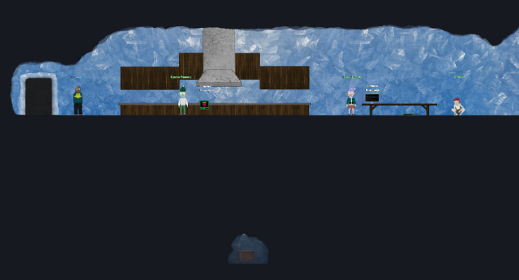

# Hidden Chests

Throughout the North Pole Subterranean Labyrinth there are 6 hidden chests that will give you KringleCoins, Hints, and other goodies if you can figure out how to reach them.

## Hints and Resources

??? hint "Other resources"
    **Burp Suite Community Edition** 
    <a href="https://portswigger.net/burp/communitydownload">https://portswigger.net/burp/communitydownload</a>

## Finding the Chests

The best way that I discovered to locate the chests is to simply zoom out your browser window as far as you can and wander the area.

Hall of Talks

NPSL (Outside Tolkien Ring)

Tolkien Ring

NPSL (Outside Elfen Ring)

Cloud Ring

NPSL (Outside Burning Ring of Fire)

## Reaching the Chests

Reaching the chests is a matter of locating the hidden 'path' that will allow you to reach them.  While this can be done by running yourself into walls until you find your way blindly in the dark, we can find a way to simplify things if we investigate the image elements that make up the site.

Each area of the map is made up of several image layers, including `/images/backgrounds/*area*_foreground.png`, and `/images/background/*area*_mask.png` image.  The combination of these layers is what hides our avatar when we move into the darkened areas of the map.  If we can prevent our browser from loading these images, then while it will distort what we see on the screen, it will allow us to see ourselves as we move through this hidden region, making it much easier to find the path.

To do this using Chrome based browsers you can setup a local override for these images (Developer Tools > Sources > Overrides), and there are extensions for Firefox that will do the same.  But in my case I opted to use the ever useful Burp Suite.

In Burp Suite, simply add two lines to the 'Match and Replace' section of the Proxy Options that will replace `mask.png` and `foreground.png` with nothing.  Note that this will result in invalid requests for the element `/images/backgrounds/*area*_`, but the page will still load fine.

## Chest Rewards

Standing on the chests will give you various rewards.  In my playthrough all the chests gave me KringleCoins.  2 of the 6 gave me hints for the <a href="../../quests/Recover_the_Burning_Ring_of_Fire/15_Blockchain_Divination/">Blockchain Divination</a> objective, and while the other 4 indicated they were giving me hints for <a href="../../quests/Recover_the_Burning_Ring_of_Fire/16_Exploit_a_Smart_Contract/">Exploit a Smart Contract</a>, only 2 hints were received.  And one gave me a special Tophat.

Hall of Talks

* 13 KringleCoins
* Hint: A Solid Hint

NPSL 1

* 27 KringleCoins
* Hint: Cryptostage

Tolkien Ring

* 15 KringleCoins
* Hint: Plant a Merkle Tree

NPSL 2

* 25 KringleCoins
* Hint: Markle Tree Aboriculture

Cloud Ring

* 10 KringleCoins
* Hint for Smart Contract (nothing given)

NPSL 3

* 20 KringleCoins
* Tophat #1
* Hint for Smart Contract (nothing given)

