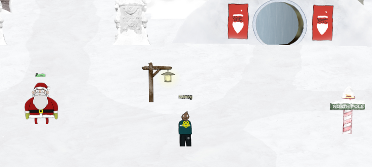

# Welcome to KringleCon 5: Golden Rings!

## Introduction

Welcome reader, to my 2022 SANS Holiday Hack Challenge Solution Guide.  I'm Nutmeg, and this is my fifth year attending KringleCon.

First off, as always, I want to thank Ed Skoudis, the Counter Hack team, and all of the great KringleCon presenters.  Once again, the team did a fantastic job producing an event that was both entertaining and educational.

I also want to thank my wife Kim, who once again resigned herself as a 'KringleCon Widow' for several weeks during the holiday season while I indulged myself in this event.

Lastly, and in no particular order, I want to acknowledge the following individuals from the Discord channel, without whose help I might still be bashing my head against the wall with <a href="quests/Recover_the_Web_Ring/10_Glamtariels_Fountain">Glamtariel's Fountain</a>.

* Annah
* bsleep
* higgy
* Fogez
* t4r
* human

## Report Format

This report is written as a guide to explain how I was able to solve each of the objectives.  I make no assertion that the methods I used are the best or most effective, or even if they are how the designer of the objective intended it to be solved (<a href="quests/Recover_the_Web_Ring/09_Open_the_Boria_Mine_Door/">Open the Boria Mine Door</a>).  Many objectives will have more than one way to complete them, and for some I have included several of the possible options (<a href="quests/Recover_the_Tolkien_Ring/03_Windows_Event_Logs/">Windows Event Logs</a>, <a href="quests/Recover_the_Elfen_Ring/06_Prison_Escape/">Prison Escape</a>), but this is by no means the case for every objective.

As this is a guide and not a full walk through of KringleCon, and to keep the length to something resembling the 50 page maximum submission size, I have omitted much of the character dialogs, story elements, LoTR references, etc. that are not directly related to the solving of objectives.  Dialogs, hints, and other resources are in in expandable call-outs to keep the page lengths down, and all answer values are similarly hidden by default for those readers who are just looking for hints and don't want to see spoilers.

This writeup is also not as dependent on screenshots as my submissions in previous years have been, again in an attempt to keep the length as efficient as possible.

## Platform and Tools

The majority of the objectives were completed on an Intel based PC running Windows 11 Home, and the primary web browser used was Firefox.

<a href="https://www.wireshark.org/#download">Wireshark</a> and <a href="https://portswigger.net/burp/communitydownload">Burp Suite Community Edition</a> were used in some way or another for many of the challenges.  

The writeup itself was created using <a href="https://squidfunk.github.io/mkdocs-material/">Material for MkDocs</a> and is hosted on <a href="https://pages.github.com/">GitHub Pages</a>.  Any necessary screenshots were taken using <a href="https://getsharex.com/">ShareX</a>, and code / writeup editing was done with <a href="https://code.visualstudio.com/">Visual Studio Code</a>.

