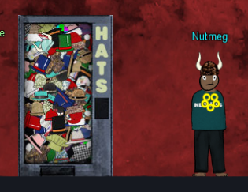

# Buy a Hat

!!! summary "Buy a hat *Difficulty*: :fontawesome-solid-tree:{: style="color: red;"}:fontawesome-solid-tree:{: style="color: red;"}:fontawesome-solid-tree:{: style="color: grey;"}:fontawesome-solid-tree:{: style="color: grey;"}:fontawesome-solid-tree:{: style="color: grey;"}"
    Travel to the Burning Ring of Fire and purchase a hat from the vending machine with KringleCoin. Find hints for this objective hidden throughout the tunnels.

## Elf Introduction

??? "Wombley Cube"
    Hey there! I'm Wombley Cube. It's so nice to see a friendly face. 
    What's an elf doing all the way down here with all these sporcs, you ask? 
    I'm selling snazzy, fancy-pants hats! You can buy them with Kringlecoin. 
    The reason I set up shop here is to gather intel on that shady Luigi. 
    I'm a member of the STINC: Santa's Team of Intelligent Naughty Catchers. 
    He and his gang are up to no good, I'm sure of it. We've got a real Code Brown here. 
    Purchase a hat so we look inconspicuous, and I'll clue you in on what we think they're scheming. 
    Of course, have a look at my inventory! 
    Oh, and if you haven't noticed, I've slipped hints for defeating these Sporcs around the tunnels! 
    Keep your eyes open, and you'll find all five of them. Wait, maybe it's six?

## Hints and Resources

??? hint "Hints from talking with Wombley Cube"
    **Hat Dispensary** 
    To purchase a hat, first find the hat vending machine in the Burning Ring of Fire. Select the hat that you think will give your character a bold and jaunty look, and click on it. A window will open giving you instructions on how to proceed with your purchase. 
     
    **Prepare to Spend** 
    Before you can purchase something with KringleCoin, you must first approve the financial transaction. To do this, you need to find a KTM; there is one in the Burning Ring of Fire. Select the Approve a KringleCoin transfer button. You must provide the target wallet address, the amount of the transaction you're approving, and your private wallet key.
     
    **Wear it Proudly!** 
    You should have been given a target address and a price by the Hat Vending machine. You should also have been given a Hat ID #. Approve the transaction and then return to the Hat Vending machine. You'll be asked to provide the Hat ID and your wallet address. Complete the transaction and wear your hat proudly! 

## Solution

1. Open the hat vending machine
2. Pick your hat
3. Note the wallet address and Hat ID value
4. Go to a KTM
5. Approve a KringleCoin transfer
6. Use the wallet address for the hat as the "To" address, 10 for the number of KringleCoins, and *your* wallet key for the key.
7. After approving the transfer, go back to the hat vending machine
8. Select the option to buy your hat
9. Enter *your* wallet address, and the Hat ID that you purchased.  *Note*, the transaction information provided may be helpful to you later.
10. Select your hat from the badge menu and wear it proudly.

## Completion

??? "Wombley Cube"
    Nice hat! I think Ed Skoudis would say the same. It looks great on you. 
    So, here's what we've uncovered so far. Keep this confidential, ok? 
    Earlier, I overheard that disgruntled customer in the office saying he wanted in on the "rug pull". 
    If our suspicions are correct, that's why the sporcs want an invite to the presale so badly. 
    Once the "Bored Sporc Rowboat Society" NFTs officially go on sale, the sporcs will upsell them. 
    After most of the NFTs are purchased by unwitting victims, the Sporcs are going to take the money and abandon the project. 
    Mission #1 is to find a way to get on that presale list to confirm our suspicions and thwart their dastardly scheme! 
    We also think there's a Ring hidden there, so drop Mission #2 on them and rescue that ring! 
    Thank you for your business, dear customer!

