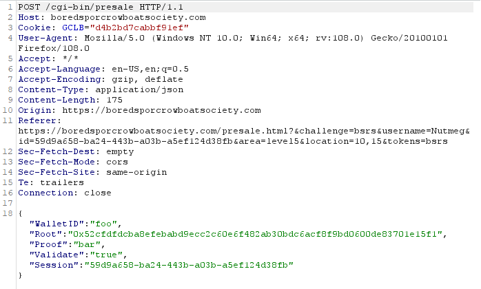

# Exploit a Smart Contract

!!! summary "Exploit a Smart Contract *Difficulty*: :fontawesome-solid-tree:{: style="color: red;"}:fontawesome-solid-tree:{: style="color: red;"}:fontawesome-solid-tree:{: style="color: red;"}:fontawesome-solid-tree:{: style="color: red;"}:fontawesome-solid-tree:{: style="color: red;"}"
    Exploit flaws in a smart contract to buy yourself a Bored Sporc NFT. Find hints for this objective hidden throughout the tunnels.

## Spork Introduction

??? quote "Luigi"
    Psst. Hey, slick - over here. Myeah. 
    You look like a sucker ahem I mean, savvy. 
    I got some exclusive, very rare, very valuable NFTs for sale. 
    But I run a KringleCoin-only business. Kapeesh? 
    Ever buy somethin' with cryptocurrency before? 
    Didn't think so, but if you wheel and deal with ya' pal Luigi here, now you can! 
    But we're currently in pre-sale, and you gotta be on the list. Myeah, see? 
    BSRS NFTs are a swell investment. They'll be worth a pretty penny, and that's a promise. 
    So when they're purchasable, you better snatch 'em up before the other boneheads ahem I mean, eggheads do. 
    I got a business to run. You can't buy nothin' right now, so scram. Kapeesh?

## Hints and Resources

??? hint "Hints from <a href="../../../extras/Hidden_Chests/">Hidden Chests</a>"
    **Plant a Merkle Tree** - From the Tolkien Ring 
    You can change something that you shouldn't be allowed to change. <a href="https://github.com/QPetabyte/Merkle_Trees">This repo</a> might help! 
     
    **Markle Tree Arboriculture** - NPLS (Outside Elfen Ring) 
    You're going to need a <a href="https://decentralizedthoughts.github.io/2020-12-22-what-is-a-merkle-tree/">Merkle Tree</a> of your own. Math is hard. <a href="https://youtu.be/Qt_RWBq63S8">Professor Petabyte</a> can help you out.

??? hint "Other resources"
    **Prof. Qwerty Petabyte, You Can Still Have Fun With Non-Fungible Tokens | KringleCon 2022** 
    <a href="https://www.youtube.com/watch?v=Qt_RWBq63S8&list=PLjLd1hNA7YVy9Xd1pRtE_TKWdzsnkHcqQ&index=4&t=6s">https://www.youtube.com/watch?v=Qt_RWBq63S8&list=PLjLd1hNA7YVy9Xd1pRtE_TKWdzsnkHcqQ&index=4&t=6s</a> 
     
    **Burp Suite Community Edition** 
    <a href="https://portswigger.net/burp/communitydownload">https://portswigger.net/burp/communitydownload</a>

## Solution

Open the Bored Sporc Rowboat Society terminal next to Luigi, and go to the Presale page.  Here we find that in order to verify that we are on the presale list we need to enter our wallet address and proof values.

Reviewing to Professor Petabyte's talk and his GitHub repo referenced to in the hints we learn that one of the big benefits to using a Merkle tree is that the producer of the blockchain only needs to store the root value of the tree in order to verify that an address is on the list.  In fact, the professor's GitHub README file contains a hint as to how we can exploit this.

!!! quote "Professor Petabyte"
    The only value the NFT producer needs to keep in their blockchain code is the root value itself! Because keeping anything stored on the blockchain is expensive, this is a huge benefit! Of course, the root mustn't be able to be altered, which is why keeping it IN the smart contract on the blockchain is what smart developers do.

If we've been conversing with the Sporcs for any length of time we can make an assumption that they are not **smart** developers, so it's likely they are storing the root to the Merkle tree somewhere unsafe.

And sure enough, if we startup Burp Suite and capture the submission of any random values to the presale form we see that they are passing the root key as part of the request.

So all we need to do is generate a Merkle tree of our own containing our wallet address, then provide that address and proof value to the form while altering the root value passed in the POST request to be the root value our **our** tree, and the validation should work.

The Professor's GitHub repo includes a Python file that can be run directly on your local system, provided the necessary libraries are available, or as a Docker image.  In either event, edit the `allowlist` variable in the code to contain your wallet address along with some other value, then run the script to generate a root and proof value.

Validate that things will work by entering your address and proof into the web form, then intercepting the POST with Burp Suite and change the root value to our root, then forward it on.  If all works as expected your address will be verified as being on the presale list.

Then it's just a matter of approving a 100 KC transaction to the address 0xe8fC6f6a76BE243122E3d01A1c544F87f1264d3a, then coming back to the presale form and repeating the process with the 'Validate Only' box unchecked.

After your transaction is complete, go to the Gallery page and find your Sporc.  Note that once you know your Sporc number you can get it directly at the URL https://boredsporcrowboatsociety.com/TOKENS/TOKENIMAGES/BSRS###.png

{ width="300" }

## Conclusion

??? quote "Luigi"
    What!? How'd you get on the list? What's that? You's a double agent, and you're actually workin' for us? 
    I don't know if I buy that, but you're on the list, so... myeah. 
    Somethin' about this ain't sittin' right with me, but there's no reversing transactions with cryptocurrency. 
    That NFT is yours to keep, but if I find out you're lyin' to me, Palzari's gonna pay you a visit. Kapeesh?

