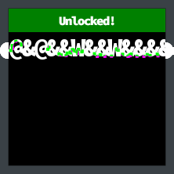
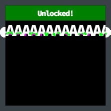
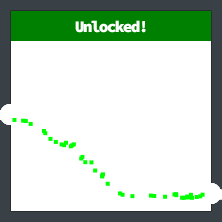
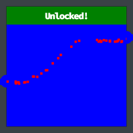
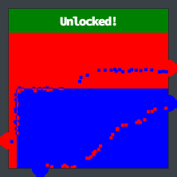
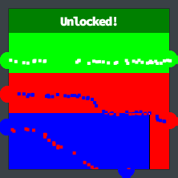

# Open the Boria Mine Door

!!! summary "Open Boria Mine Door<br>*Difficulty*: :fontawesome-solid-tree:{: style="color: red;"}:fontawesome-solid-tree:{: style="color: red;"}:fontawesome-solid-tree:{: style="color: red;"}:fontawesome-solid-tree:{: style="color: grey;"}:fontawesome-solid-tree:{: style="color: grey;"}"
    Open the door to the Boria Mines. Help Alabaster Snowball in the Web Ring to get some hints for this challenge.
    


## Elf Introduction

??? quote "Hal Tandybuck"
    Oh hi, I'm Hal Tandybuck. And who might you be?<br>
    I'm hanging out by the door to the mines here because, well, I haven't figured out the locks yet.<br>
    It actually reminds me of this locked crate I had three years ago...<br>
    I doubt we'll get much in the way of debug output.<br>
    Think you can help me get through?

## Hints and Resources

??? hint "Hints received from Alabaster Snowball after completing <a href="../08_Boria_PCAP_Mining/">Boria PCAP Mining</a>"
    **Lock Mechanism**<br>
    The locks take input, render some type of image, and process on the back end to unlock. To start, take a good look at the source HTML/JavaScript.<br>
    <br>
    **Content Security-Policy**<br>
    Understanding how <a href="https://cheatsheetseries.owasp.org/cheatsheets/Content_Security_Policy_Cheat_Sheet.html">Content-Security-Policy</a> works can help with this challenge.
    <br>
    **Input Validation**<br>
    Developers use both client- and server-side <a href="https://cheatsheetseries.owasp.org/cheatsheets/Input_Validation_Cheat_Sheet.html">input validation</a> to keep out naughty input.<br>
    <br>

??? hint "Other resources"
    **HTML SVG Graphics**<br>
    <a href="https://www.w3schools.com/html/html5_svg.asp">https://www.w3schools.com/html/html5_svg.asp</a><br>
    <br>
    **Burp Suite Community Edition**<br>
    <a href="https://portswigger.net/burp/communitydownload">https://portswigger.net/burp/communitydownload</a>

## Solution

Opening the terminal next to Hal Tandybuck presents us with an instruction page telling us that we need to somehow connect the sensors for each pin using appropriate characters, then we are presented with 6 pins, the first 3 of which need to be opened in order to complete the challenge.

Alabaster's first hint suggests that we inspect the source HTML / JavaScript, so either proxy the traffic through Burp Suite or open the browser Developer Tools and reload the page.  Search the network traffic for requests for the URLs `/pin1` - `/pin6` and inspect the response to get the HTML source.


### Pin 1

The HTML source for the first pin is relatively straightforward, and provides us with an answer to solve the first one.

??? abstract "Pin1 HTML"
    ``` html linenums="1"
    <!DOCTYPE html>
    <html lang="en">
    <head>
        <meta charset="UTF-8">
        <meta http-equiv="X-UA-Compatible" content="IE=edge">
        <meta name="viewport" content="width=device-width, initial-scale=1.0">
        <title>Lock 1</title>
        <link rel="stylesheet" href="pin.css">
    </head>
    <body>
        <form method='post' action='pin1'>
            <!-- @&@&&W&&W&&&& -->
            <input class='inputTxt' name='inputTxt' type='text' value='' autocomplete='off' />
            <button>GO</button>
        </form>
        <div class='output'></div>
        
        
        <!-- js -->
        <script src='pin.js'></script>
    </body>
    </html>
    ```

Here we see in the comment a character string that when entered into the pin will complete the circuit.

??? success "Pin 1 Answer"
    ```
    @&@&&W&&W&&&&
    ```
    

At this point some experimentation is necessary to figure out what is going on.  As it turns out, this is not the only way to open the first pin.  Whatever characters you enter will be rendered as an HTML image, and so long as the characters touch in such a way that a path is created between the two pins the pin will open.

??? success "Pin 1 Alternate Answer"
    ```
    AAAAAAAAAAAAA
    ```
    

### Pin 2

The code for pin2 is identical to pin1, but adds a Content-Security-Policy.  This policy will disallow the loading of styles or scripts from anywhere but the same site that the page is loading from, but will allow inline scripts.

??? abstract "Pin2 HTML"
    ``` html linenums="1"
    <!DOCTYPE html>
    <html lang="en">
    <head>
        <meta charset="UTF-8">
        <meta http-equiv="X-UA-Compatible" content="IE=edge">
        <meta name="viewport" content="width=device-width, initial-scale=1.0">
        <meta http-equiv="Content-Security-Policy" content="default-src 'self';script-src 'self';style-src 'self' 'unsafe-inline'">
        <title>Lock 2</title>
        <link rel="stylesheet" href="pin.css">
    </head>
    <body>
        <form method='post' action='pin2'>
            <!-- TODO: FILTER OUT HTML FROM USER INPUT -->
            <input class='inputTxt' name='inputTxt' type='text' value='' autocomplete='off' />
            <button>GO</button>
        </form>
        <div class='output'></div>
        
        
        <!-- js -->
        <script src='pin.js'></script>
    </body>
    </html>
    ```

Now we just need to figure out a way to input something that when rendered into an HTML image will connect the lines.  We could perhaps load an image from an external source, but an easier method is to generate an image using an HTML SVG (Scalable Vector Graphics) element.

Inspecting the results from our first pin in Developer Tools we see that it created an image that is 200 x 170 pixels in size.  So if we create a white square of this size using SVC it will complete the second pin.

??? success "Pin 2 Answer"
    ```
    <svg width="200" height="170"><rect width="100%" height="100%" fill="white" /></svg>
    ```
    

### Pin 3

The only change in the source for Pin 3 removes the `default-src 'self'` directive from the Content-Security-Policy

??? abstract "Pin 3 HTML"
    ``` html linenums="1"
    <!DOCTYPE html>
    <html lang="en">
    <head>
        <meta charset="UTF-8">
        <meta http-equiv="X-UA-Compatible" content="IE=edge">
        <meta name="viewport" content="width=device-width, initial-scale=1.0">
        <meta http-equiv="Content-Security-Policy" content="script-src 'self' 'unsafe-inline'; style-src 'self'">
        <!-- <meta http-equiv="Content-Security-Policy" content="default-src 'self'; img-src https://*; child-src 'none';"> -->
        <title>Lock 3</title>
        <link rel="stylesheet" href="pin.css">
    </head>
    <body>
        <form method='post' action='pin3'>
            <!-- TODO: FILTER OUT JAVASCRIPT FROM USER INPUT -->
            <input class='inputTxt' name='inputTxt' type='text' value='' autocomplete='off' />
            <button>GO</button>
        </form>
        <div class='output'></div>
        
        
        <!-- js -->
        <script src='pin.js'></script>
    </body>
    </html>
    ```

However, this doesn't affect the method that we used for Pin 2, so we can use the same code for Pin 3, noting however that this time the circuit ends are blue.

??? success "Pin 3 Answer"
    ```
    <svg width="200" height="170"><rect width="100%" height="100%" fill="blue" /></svg>
    ```
    


## Part 1 Completion

??? quote "Hal Tandybuck"
    Great! Thanks so much for your help!<br>
    When you get to the fountain inside, there are some things you should consider.<br>
    First, it might be helpful to focus on Glamtariel's CAPITALIZED words.<br>
    If you finish those locks, I might just have another hint for you!

### Pins 4-5

Pins 4-6 get a little more complicated.
* Pin 4 includes a sanitization script that will disallow the use of the characters `"`, `'`, `<`, or `>`
* Pin 5 has the same sanitization script as Pin 4, but also has a Content-Security-Policy
* Pin 6 has only a policy, presumably performing the sanitization on the server


??? abstract "Pin 4 HTML"
    ``` html linenums="1"
    <!DOCTYPE html>
    <html lang="en">
    <head>
        <meta charset="UTF-8">
        <meta http-equiv="X-UA-Compatible" content="IE=edge">
        <meta name="viewport" content="width=device-width, initial-scale=1.0">
        <title>Lock 4</title>
        <link rel="stylesheet" href="pin.css">
        <script>
            const sanitizeInput = () => {
                const input = document.querySelector('.inputTxt');
                const content = input.value;
                input.value = content
                    .replace(/"/, '')
                    .replace(/'/, '')
                    .replace(/</, '')
                    .replace(/>/, '');
            }
        </script>
    </head>
    <body>
        <form method='post' action='pin4'>
            <input class='inputTxt' name='inputTxt' type='text' value='' autocomplete='off' onblur='sanitizeInput()' />
            <button>GO</button>
        </form>
        <div class='output'></div>
        
        
        <!-- js -->
        <script src='pin.js'></script>
    </body>
    </html>
    ```

??? abstract "Pin 5 HTML"
    ``` html linenums="1"
    <!DOCTYPE html>
    <html lang="en">
    <head>
        <meta charset="UTF-8">
        <meta http-equiv="X-UA-Compatible" content="IE=edge">
        <meta name="viewport" content="width=device-width, initial-scale=1.0">
        <meta http-equiv="Content-Security-Policy" content="script-src 'self' 'unsafe-inline'; style-src 'self'">
        <title>Lock 5</title>
        <link rel="stylesheet" href="pin.css">
        <script>
            const sanitizeInput = () => {
                const input = document.querySelector('.inputTxt');
                const content = input.value;
                input.value = content
                    .replace(/"/gi, '')
                    .replace(/'/gi, '')
                    .replace(/</gi, '')
                    .replace(/>/gi, '');
            }
        </script>
    </head>
    <body>
        <form method='post' action='pin5'>
            <input class='inputTxt' name='inputTxt' type='text' value='' autocomplete='off' onblur='sanitizeInput()' />
            <button>GO</button>
        </form>
        <div class='output'></div>
        
        
        <!-- js -->
        <script src='pin.js'></script>
    </body>
    </html>
    ```

??? abstract "Pin 6 HTML"
    ``` html linenums="1"
    <!DOCTYPE html>
    <html lang="en">
    <head>
        <meta charset="UTF-8">
        <meta http-equiv="X-UA-Compatible" content="IE=edge">
        <meta name="viewport" content="width=device-width, initial-scale=1.0">
        <meta http-equiv="Content-Security-Policy" content="script-src 'self'; style-src 'self'">
        <title>Lock 6</title>
        <link rel="stylesheet" href="pin.css">
    </head>
    <body>
        <form method='post' action='pin6'>
            <input class='inputTxt' name='inputTxt' type='text' value='' autocomplete='off' />
            <button>GO</button>
        </form>
        <div class='output'></div>
        
        
        <!-- js -->
        <script src='pin.js'></script>
    </body>
    </html>
    ```

As we have shown with Pins 1-3, the Content-Security-Policy really isn't a hinderance to us, but the sanitization script is.  That is, it would if there were not a flaw in its implementation.

The code specifies that the sanitization script should run when the onblur event triggers.  This event occurs when focus is changed from the current element, in this case, the form field.  This would happen when the [GO] button is clicked.

However, the input can also be submitted by pressing enter while focus remains on the form field.  This will submit the value to the server without triggering the onblur event, therefore the sanitization routine is never called.  And while we cannot confirm it by inspecting the code, this method also works for Pin 6.

The SVG code is a little more complicated for these pins as there are multiple colors, but with a little work something can be created that will work.  Note that while the white, blue, and red SVG fill values match the colors of those pins, the value 'green' does not match the green used for the pin, so the explicit RGB value needs to be used instead.

??? success "Pin 4 Answer"
    ```
    <svg width="200" height="170">
        <rect x="0" y="0" width="200" height="85" fill="white" />
        <rect x="0" y="85" width="200" height="85" fill="blue" />
    </svg>
    ```
    

??? success "Pin 5 Answer"
    ```
    <svg width="200" height="170">
        <rect x="0" y="0" width="200" height="70" fill="red" />
        <rect x="0" y="70" width="10" height="100" fill="red" />
        <rect x="10" y="70" width="190" height="100" fill="blue" />
    </svg>
    ```
    

??? success "Pin 6 Answer"
    ```
    <svg width="200" height="170">
        <rect x="0" y="0" width="200" height="50" fill="#00ff00" />
        <rect x="0" y="50" width="200" height="50" fill="red" />
        <rect x="0" y="100" width="175" height="70" fill="blue" />
        <rect x="176" y="100" width="25" height="70" fill="red" />
    </svg>
    ```
    


## Part 2 Completion

??? quote "Hal Tandybuck"
    Wha - what?? You opened all the locks?! Well then...<br>
    Did you see the nearby terminal with evidence of an XXE attack?<br>
    Maybe take a close look at that kind of thing.
